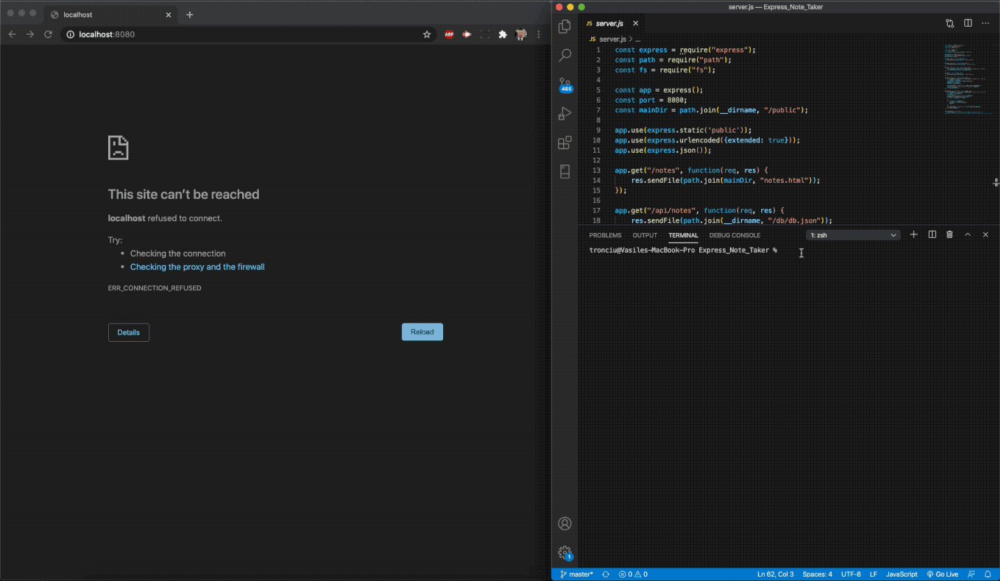

# Express Note Taker
Note taking application designed to write, save, and delete notes, written to and retrieved from a backend JSON file

## Example Usage

## Approach
As the front end was already created, I needed to look at connecting this to the backend. I broke down the problem into smaller objectives:
1. Start a server using Express
2. Link the HTML to get and post requests in the backend JavaScript
3. Write the user's notes to the server's JSON file with unique IDs
4. The post method needs to write the note to the JSON file for retrieval
5. The get method needs to retrieve notes from the server for viewing
6. The delete method needs to locate and delete specific notes from the server

## Installing
Run `npm install` to install all dependencies. To use the application locally, run `node server.js` in your terminal, and then open `http://localhost:8080` in your preferred browswer. The Note Taker app is <a href=" https://tronciu-note-taker.herokuapp.com/">live on Heroku</a> for you to use as well.
